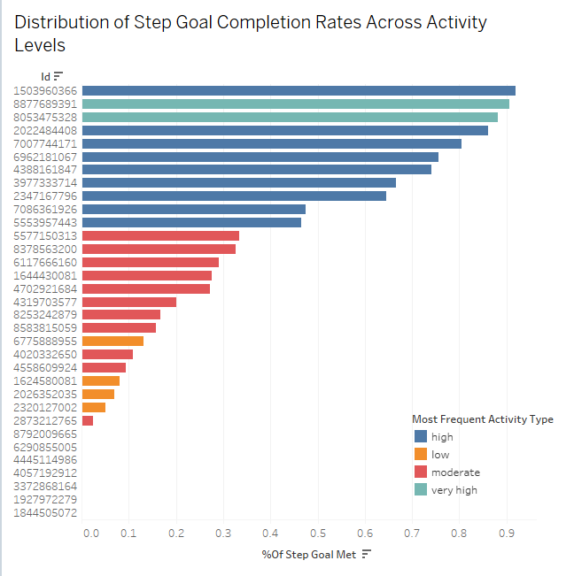
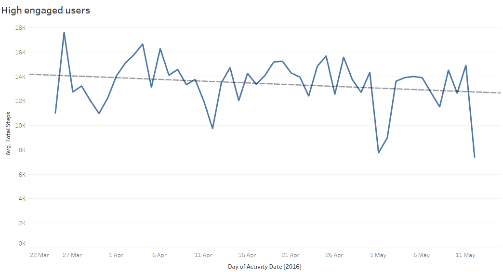
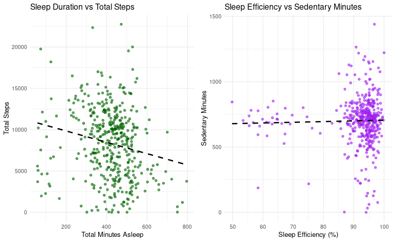
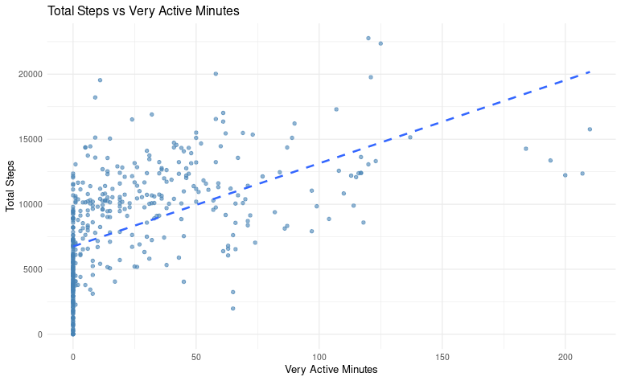
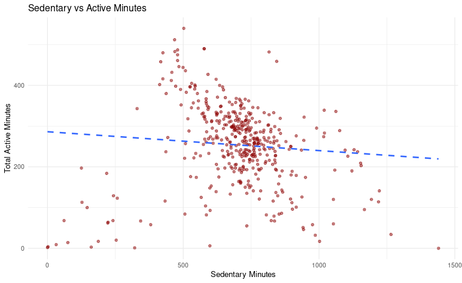

# Bellabeat Case Study Report - Consumer Insights from Smart Device Data

## Project Background
This project analyzes data collected from Fitbit-style wearable devices to understand patterns in physical activity. By leveraging smart device data, the goal is to identify user behaviors and transform those findings into actionable insights for Bellabeat — a company focused on wellness products.

## About the company
Bellabeat is a high-growth wellness technology company that designs smart health-focused products primarily for women. Their offerings include smart jewelry like the Bellabeat Leaf, which tracks activity, sleep, stress, and reproductive health through a connected mobile app.

## Objective 
To analyze smart device usage behavior and derive insights to:
- Segment Bellabeat users based on activity
- Recommend app/product enhancements
- Shape personalized marketing strategies

## Executive Summary
This analysis examines fitness tracker data from 41 users to identify patterns in physical activity, sleep behavior, and app engagement. The results show that high-activity users regularly meet or exceed their step goals, while low-activity users achieve less than 20% of theirs. Engagement declines notably after six weeks, and weekend data recording is consistently lower. Very active minutes are a strong driver of total step count, whereas longer sleep durations tend to correlate with lower activity levels. Based on these insights, we recommend that Bellabeat implement personalized goal-setting, targeted weekend engagement strategies, and retention-focused features to support long-term user motivation and healthier lifestyle habits.

# Key Insights from Fitness Tracker Data Analysis

## 1. User Engagement and Goal Achievement Patterns

### Step Goal Completion Varies Significantly Across Activity Levels

Our analysis reveals a clear stratification in step goal achievement based on overall activity levels:

- **High-activity users** (blue bars) consistently achieve **60–95%** of their step goals, with many reaching near-complete success rates.
- **Very high-activity users** (teal bars) demonstrate **exceptional goal completion**, often exceeding **90%** achievement rates.
- **Moderate-activity users** (red bars) show **more variable performance**, typically achieving **20–50%** of step goals.
- **Low-activity users** (orange bars) struggle significantly, rarely exceeding **20%** achievement rates.

**Implication for Bellabeat:** Introduce **adaptive goal-setting algorithms** that adjust targets based on individual activity patterns to maintain motivation across all user segments.

## 2. Temporal Usage Patterns and Data Quality

### User Engagement Shows Concerning Decline Over Time

Longitudinal analysis of high-engaged users reveals:

- **Initial engagement spike:** Peak activity around **late March** (18K+ average steps).
- **Gradual decline:** Steady decrease in engagement over the **2-month period**.
- **Significant drop-off:** Sharp decline in **early May**, falling to ~8K steps.
- **Recovery attempts:** Brief upticks suggest users try to re-engage but struggle to maintain consistency.

### Weekly Data Recording Patterns Are Inconsistent

- **Tuesday** shows peak recording (~195 entries), suggesting **mid-week motivation**.
- **Monday and Sunday** have lowest recording (~165 entries), indicating **weekend/Monday blues**.
- **Weekday** recording is generally more consistent than **weekend** recording.

**Implication for Bellabeat:** Implement **targeted engagement strategies**, especially for **weekends** and **long-term retention programs** to combat the natural decline in usage over time.

## 3. Sleep-Activity Relationship Insights

### Sleep Duration Negatively Correlates with Daily Activity

An inverse relationship emerged between sleep and physical activity:

- **Longer sleep duration** (400–600 minutes) correlates with **fewer daily steps** (5,000–10,000).
- **Shorter sleep duration** (100–300 minutes) often linked to **higher step counts** (10,000–20,000+).
- **Wide variation** suggests individual differences in sleep needs and activity patterns.

### Sleep Efficiency Remains Independent of Sedentary Behavior

- **No strong correlation** between sedentary minutes and sleep efficiency.
- Most users maintain **80–100% sleep efficiency** regardless of daily sedentary time.
- Outliers with poor sleep efficiency (**50–60%**) appear across all sedentary time ranges.

**Implication for Bellabeat:** Treat **sleep and activity coaching as separate, personalized health domains** rather than directly linked metrics.

## 4. Activity Intensity Relationships

### Very Active Minutes Drive Overall Step Count

 

- **Strong linear relationship:** More intense activity directly translates to higher daily step counts.
- **Threshold effect:** Users with **50+ very active minutes** consistently achieve **10,000+ steps**.
- **Diminishing returns:** Beyond **100 very active minutes**, step count increases level off.

### Sedentary and Active Time Show Inverse Relationship

- **Negative correlation:** As **sedentary time increases**, **active minutes decrease**.
- **Concentration pattern:** Most users cluster around **500–800 sedentary minutes** and **200–300 active minutes**.
- **Extreme outliers:** Some users have **1,200+ sedentary minutes** with minimal activity.

## Strategic Recommendations for Bellabeat

1. **Personalized Goal Setting:**  
   Implement adaptive algorithms that adjust step goals based on individual activity levels and historical performance.

2. **Retention-Focused Features:**  
   Develop specific interventions for the **critical 6–8 week period** when user engagement typically declines.

3. **Weekend Engagement:**  
   Create targeted **weekend challenges** or reminders to maintain consistent data recording and activity.

4. **Holistic Health Approach:**  
   Treat **sleep and activity** as independent health pillars, avoiding oversimplified correlations in coaching.

5. **Intensity-Based Coaching:**  
   Focus on increasing **very active minutes** as a key driver for overall daily activity improvement.

6. **Segmented User Experience:**  
   Tailor the app experience for **high, moderate, and low-activity users** to meet them where they are in their fitness journey.
   
   ## Assumptions & Limitations

This analysis is based on a dataset containing **activity and health tracking data from 41 unique users** over a period of approximately two months. While valuable trends and patterns have been identified, the following limitations should be acknowledged:

- **Sample Size:** With only 41 individual IDs, the dataset is **not statistically representative** of a larger or more diverse population. Results should be interpreted as indicative, not conclusive.
- **Data Granularity:** The dataset lacks detailed demographic information such as **age, gender, occupation, or fitness goals**, which could provide essential context for personalized insights.
- **User Consistency:** Not all users recorded data consistently throughout the observation period, introducing potential bias in longitudinal and temporal analyses.
- **Device Uniformity Assumption:** It is assumed that all users wore the same device with identical settings and measurement capabilities — a potential oversimplification.
- **Sleep and Activity Accuracy:** Sleep efficiency and activity minutes are treated at face value; no validation was done on the **method of measurement or potential inaccuracies** in device tracking.

> **Interpretation Note:** While trends (such as the drop in engagement over time or goal completion differences) are directionally helpful, **a richer dataset with more users, consistent logging, and demographic variables** would allow for more robust and generalizable insights.

---

## Data Source & Acknowledgments

This project was completed as part of the **Google Data Analytics Professional Certificate** on Coursera. The dataset used is:

- Originally available on **[Kaggle – Bellabeat Fitness Tracker Dataset](https://www.kaggle.com/datasets/arashnic/fitbit)**
- **Synthetic or anonymized data** that does not contain real personal health information
- Provided for educational and portfolio purposes only

> **Disclaimer:** All findings, visualizations, and recommendations are based on **publicly available, de-identified data** and do not reflect actual Bellabeat customers.

---

## ️ Tools Used
- **Languages & Software:** R, Excel 
- **Libraries:** `ggplot2`, `dplyr`, `lubridate`, `tidyr`  
- **Output Format:** R Markdown → HTML  
- **Visualizations:** Created using `ggplot2` and tableau  

